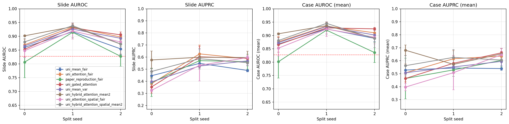
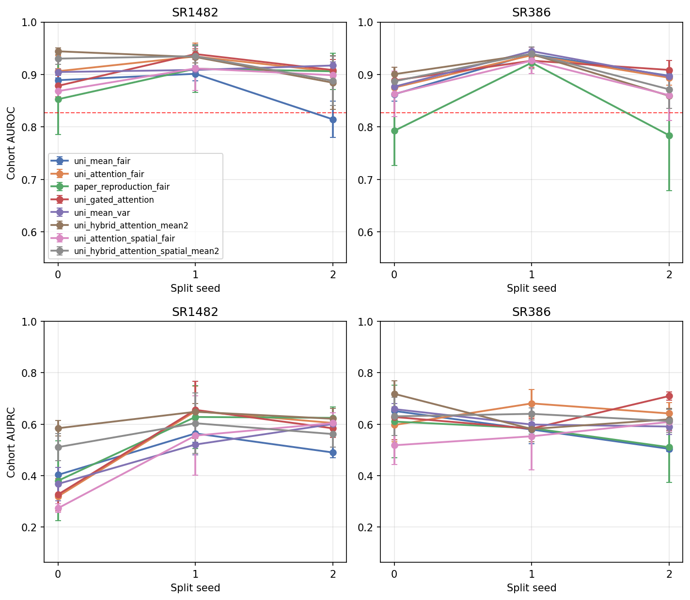
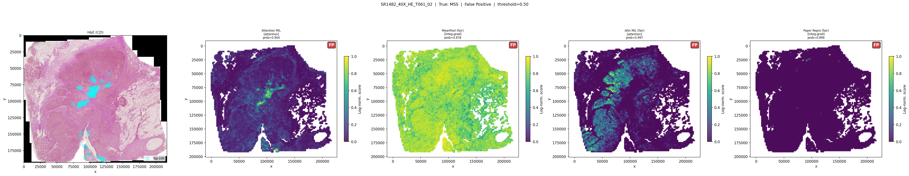
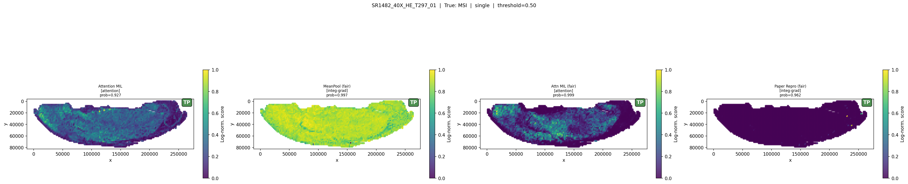
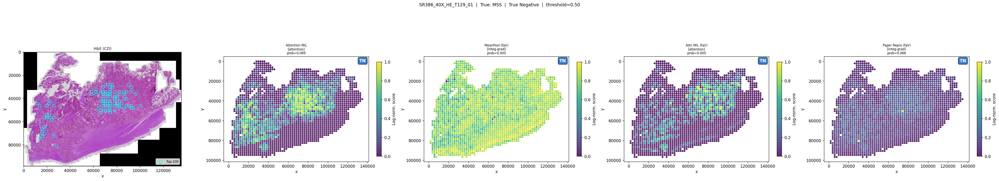
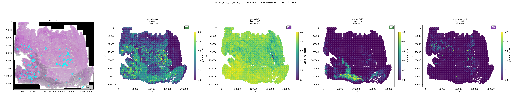

# surgen-mil

> **In weakly supervised WSI classification, performance is often not limited by feature
> representation, but by aggregation and generalization under sparse, noisy evidence.**

This repository investigates that claim empirically using UNI embeddings on the SurGen colorectal
cancer dataset. Three aggregation strategies — mean pooling, attention MIL, and transformer MIL —
are evaluated under controlled, comparable conditions across multiple seeds and data splits.

---

## What This Repository Tests

Three hypotheses drive the experimental design:

1. **Feature representations (UNI embeddings) already encode discriminative signal** — a linear
   probe or simple pooling baseline should perform well without fine-tuning.
2. **Simple aggregation (mean pooling) provides a strong and stable baseline** — competitive with
   more expressive methods at this data scale and label regime.
3. **Increasing aggregation complexity introduces instability without consistent gains** — more
   parameters can amplify noise rather than resolve it under weak supervision.

---

## Main Findings

| Model | AUROC (mean ± std) | AUPRC (mean ± std) |
|-------|--------------------|--------------------|
| MeanPool (weighted BCE) | **0.860 ± 0.005** | 0.447 ± 0.019 |
| AttentionMIL (weighted BCE) | 0.869 ± 0.020 | 0.381 ± 0.052 |
| TransformerMIL (weighted BCE) | 0.806 ± 0.057 | 0.391 ± 0.116 |
| *Paper baseline (Myles et al.)* | *0.827* | *—* |

*3 seeds × fixed split (split_seed=0), temperature scaling. See `docs/results_summary.md`.*
*Paper baseline: Myles et al. (2025), GigaScience — doi:10.1093/gigascience/giaf086.*


We observe:

- **Frozen UNI embeddings are strongly discriminative** without any fine-tuning: MeanPool and
  AttentionMIL exceed the paper reference AUROC of 0.827 on this split, consistent with
  hypothesis 1.
- **Mean pooling is the most stable baseline**: lowest cross-seed AUROC variance (±0.005),
  consistent performance across all three seeds — supporting hypothesis 2.
- **AttentionMIL is competitive but seed-dependent**: matched or exceeded MeanPool in some runs,
  but with 4× higher AUROC variance (±0.020 vs ±0.005). Consistent with hypothesis 3.
  See `docs/results_summary.md` for per-seed breakdown.
- **TransformerMIL (6.8M params)** produced the lowest mean AUROC (0.806), highest variance
  (±0.057), and highest compute cost — the clearest case of complexity amplifying noise.
- **Sparse evidence selection (top-k attention)** improves AUPRC (0.455 vs 0.381) but reduces
  AUROC (0.853 vs 0.869); not robustly superior. See Appendix C in `docs/appendix.md`.
- **Multisplit evaluation is the stronger summary**: across 3 data splits × 3 seeds, the best
  model is `HybridAttentionMIL` at 0.903 ± 0.033 AUROC and 0.591 ± 0.054 AUPRC.

### Stability Analysis

Stability — measured as cross-seed variance — is treated as a first-class metric here. In weak
supervision, a system that performs well on average but varies widely across seeds provides
weaker guarantees than a stable but slightly lower-scoring baseline.

| Model | AUROC std | AUPRC std | Interpretation |
|-------|-----------|-----------|----------------|
| MeanPool | ±0.005 | ±0.019 | Trustworthy baseline |
| AttentionMIL | ±0.020 | ±0.052 | Competitive but sensitive |
| TransformerMIL | ±0.057 | ±0.116 | Instability dominates gains |

A model's ranking by mean AUROC is less informative than its ranking by mean AUROC relative to
its variance. Stability is a proxy for trustworthiness under weak supervision.

---

## Repository Layout

```
surgen-mil/
  train.py                     # main training script
  configs/
    uni_mean_fair.yaml         # MeanPool (main comparison)
    uni_attention_fair.yaml    # AttentionMIL (main comparison)
    paper_reproduction_fair.yaml  # TransformerMIL (main comparison)
    appendix/                  # ablation configs
    ...                        # additional exploratory configs
  src/
    data/                      # feature provider, sampler, splits, dataset
    models/                    # aggregators: mean, attention, transformer, gated, lse, topk, region
    losses.py                  # BCE, focal loss factories
  scripts/
    smoke_test.py              # synthetic end-to-end test
    evaluate.py                # standalone evaluation from checkpoint
    compare_models.py          # multi-seed summary table + plots
    make_figures.py            # generate ROC/PR figures
    export_predictions.py      # export per-slide predictions from checkpoint
    inspect_attention.py       # attention weight diagnostics
    sampler_diagnostics.py     # quantify sampler coverage/diversity on real slides
    run_fair_comparison.sh     # train all 3 models x 3 seeds
    run_main_multisplit_updates.sh  # mainline updates across split seeds 0/1/2
    run_phase1_sampler_ablation.sh  # train mean/attention x sampler ablation
    run_appendix.sh            # train appendix models x 3 seeds
    analyse.py                 # cohort-level analysis
    seed_comparison.py         # detailed multi-seed aggregation
    appendix_tables.py         # generate appendix A/B/C tables
    failures/                  # exploratory error analysis
  docs/
    project_overview.md
    data_format.md
    reproducibility.md
    results_summary.md
    appendix.md
    future_work.md
    packaging_and_deployment.md
    architecture_configs.md
    attention_visualization.md
  tests/                       # unit tests (no real data required)
  examples/                    # sample manifest, config overrides, expected outputs
```

---

## Installation

```bash
python -m venv .venv
source .venv/bin/activate
pip install -e .
pip install -r requirements-core.txt
```

For GPU (CUDA 11.8):
```bash
pip install torch --index-url https://download.pytorch.org/whl/cu118
```

---

## Quickstart

```bash
# 1. Verify installation (no real data needed)
make smoke

# 2. Run unit tests
make test

# 3. Train a fair-comparison baseline
make train-mean

# 4. Evaluate the latest checkpoint for a config
make evaluate CONFIG=configs/uni_mean_fair.yaml
```

Training note:
- When `data.max_patches` is set, train-time patch bags are sampled on fetch, so the same slide can be seen with different patch subsets across epochs.
- Validation and test remain full-bag by default.

---

## Expected Data Format

```
<data_root>/
  embeddings/
    SR1482_40X_HE_T1_0.zarr   # features: [N, 1024], coords: [N, 2]
    SR1482_40X_HE_T2_0.zarr
    ...
  SR1482_labels.csv            # columns: case_id, MSI, MMR
  SR386_labels.csv             # columns: case_id, mmr_loss_binary
```

Set `data.root` in your config to point to this directory. See `docs/data_format.md` for full details.

---

## Reproducing the Main Comparison

Train all three models with three seeds each (parallel streams, fixed split):

```bash
make fair-comparison
```

Summarise results:
```bash
make compare
```

## Multi-Split Mainline Updates

The expanded mainline sweep includes the original fair-comparison trio plus:

- `configs/uni_gated_attention.yaml`
- `configs/uni_mean_var.yaml`
- `configs/uni_hybrid_attention_mean2.yaml`
- `configs/uni_attention_spatial_fair.yaml`
- `configs/uni_hybrid_attention_spatial_mean2.yaml`
- `configs/uni_transformer_spatial_fair.yaml` via the dedicated transformer launcher below

Run the full suite across split seeds `{0,1,2}` and training seeds `{42,123,456}` with:

```bash
make multisplit-updates
```

or:

```bash
MAX_PARALLEL=2 bash scripts/run_main_multisplit_updates.sh
```

Outputs are written to `outputs/multisplit/<config_name>/split_<seed>/`.
If a config already has canonical runs in its original output directory for the requested split
(for example the existing split-0 fair-comparison runs), the launcher skips retraining and
creates a symlink into the `outputs/multisplit/` tree instead.

Generate the multisplit summary tables and plots with:

```bash
make multisplit-analyse
```

Generate multisplit attention visualisations with:

```bash
make multisplit-attn
```

Run the spatial TransformerMIL multisplit sweep with:

```bash
bash scripts/run_transformer_spatial_multisplit.sh
```

or with reduced parallelism:

```bash
MAX_PARALLEL=2 bash scripts/run_transformer_spatial_multisplit.sh
```

Representative multisplit analysis plots:





---

## Reproducing Appendix Analyses

```bash
# Train appendix models
make appendix

# Train Phase 1 sampler ablation
bash scripts/run_phase1_sampler_ablation.sh

# Validate sampler behaviour before training:
python scripts/sampler_diagnostics.py \
  --configs configs/appendix/phase1_mean_random.yaml \
            configs/appendix/phase1_mean_spatial.yaml \
            configs/appendix/phase1_mean_feature_diverse.yaml \
  --split train --repeats 3 --out outputs/sampler_diagnostics

# Generate appendix tables (A, B, C)
make appendix-tables
```

See `docs/appendix.md` for interpretation of each section.

---

## Attention Visualization

Attention-MIL models produce per-patch attention weights that can be projected back onto slide
coordinates to identify which tissue regions received high weight from the model. These weights
are learned end-to-end from slide-level BCE supervision — they are not validated pathology
annotations and should not be interpreted as direct indicators of biological ground truth. Attention
patterns vary across seeds and model checkpoints, reflecting the stochasticity of training at this
sample size; any individual attention map is one representative draw from an uncertain distribution
over which patches the model found useful during that training run.

The script auto-selects TP/FP/FN/TN examples ranked by classification count and mean predicted
probability across model×seed combinations:

```bash
# Auto-select representative TP/FP/FN/TN slides (3 per category)
make attn-auto

# Seed-variance grid
make attn-seed-grid

# Single-slide view
make attn-slide SLIDE_ID=SR1482_40X_HE_T1_0

# Attention statistics from the latest AttentionMIL checkpoint
make attn-stats
```

Slides are selected by ranking: for each category (TP/FP/FN/TN), slides are ranked by how
frequently they fall into that category across model×seed combinations and by their mean predicted
probability. The examples shown are the highest-ranked slides under that criterion — not slides
that are unanimously classified the same way by all models.

False positive (true MSS, all models predict MSI — systematic failure):



True positive (true MSI, models consistently recover the signal):



True negative (true MSS, all models correctly suppress):



False negative (true MSI, model evidence remains weak or diffuse):



See `docs/attention_visualization.md` for full usage, figure layout, colormap details,
and interpretation guidance.

## Make Targets

The `Makefile` is the fastest way to discover the current command surface:

```bash
make help
```

Common targets:

- `make smoke`
- `make test`
- `make train-mean`
- `make train-attention`
- `make train-transformer`
- `make fair-comparison`
- `make multisplit-updates`
- `make multisplit-analyse`
- `make multisplit-attn`
- `make appendix`
- `make appendix-tables`
- `make compare`
- `make evaluate CONFIG=...`
- `make attn-auto`
- `make attn-seed-grid`
- `make attn-slide SLIDE_ID=...`
- `make attn-stats`
- `make errors`
- `make error-report`

---

## Outputs

Each training run writes to `outputs/<model_name>/runs/NNN/`:

| File | Description |
|------|-------------|
| `config.yaml` | Config used for this run |
| `model.pt` | Best model weights (by val AUPRC) |
| `metrics.json` | Test AUROC, AUPRC, temperature, case-level metrics |
| `predictions.csv` | Per-slide probabilities for all splits |
| `history.json` | Per-epoch training metrics |
| `training_curve.png` | Loss and AUROC training curves |

See `examples/expected_outputs.md` for the full schema.

---

## Deployment / Inference

To export predictions from a trained checkpoint without retraining:

```bash
python scripts/export_predictions.py \
  --config configs/uni_mean_fair.yaml \
  --checkpoint outputs/uni_mean_fair/runs/001/model.pt \
  --split all \
  --out my_predictions.csv
```

See `docs/packaging_and_deployment.md` for GPU requirements, threshold configuration, and notes
on what this repo does NOT include (raw WSI preprocessing, UNI feature extraction).

---

## Observed Failure Modes

These are aggregation failures, not representation failures:

- **Attention collapse**: attention weights concentrate on a small number of patches or become
  near-uniform, especially under sparse positive evidence. The model fails to aggregate
  distributed signal.
- **High seed sensitivity in parameterized aggregators**: learned attention/transformer weights
  are unstable across random initializations at this sample size, producing wide performance
  variance despite identical architecture and data.
- **Noise amplification**: expressive aggregators overfit to patch-level noise patterns rather
  than slide-level signal, particularly when the positive class is underrepresented.
- **Threshold instability**: optimal decision thresholds vary significantly across seeds in
  high-variance models, reducing reliability in deployment scenarios.

---

## Evaluation Philosophy

We do not optimize for peak performance alone.

We evaluate:
- **Stability across seeds** — variance is reported alongside mean for all metrics
- **Consistency of ranking** — a model that ranks differently across splits is less trustworthy
  than one with lower but consistent performance
- **Behavior under sampling variation** — train-time patch subsampling tests robustness to
  incomplete evidence

The goal is to understand whether a system can be trusted, not just whether it scores well.

---

## Limitations

- Small sample size: both cohorts have limited cases relative to expressive model complexity.
- Weak supervision: slide-level labels only; no patch-level annotation available.
- Single-site data: generalisability to other scanners/staining protocols is not validated.
- Label noise: IHC- and PCR-derived labels may have different error rates.

---

## Future Directions

**Extending the pipeline investigated here:**

- **Mixture of Experts feature transformation** — the linear projection between foundation model
  embeddings and the aggregator conditions how well aggregation can express trust. Mammoth (Shao
  et al., ICLR 2026) replaces this single projection with a parameter-efficient MoE that routes
  each patch to phenotype-specialised subspaces — reporting +3.8% average gains across 8 MIL
  methods as a drop-in replacement. If aggregation is where trust manifests, the transformation
  feeding it determines whether that trust is well-posed or ill-conditioned. The pipeline
  investigated here (`UNI → linear → aggregator`) is exactly the regime Mammoth targets.
- **Controlled noise injection** — testing how each aggregator degrades as patch-level noise
  increases would give a direct empirical handle on trust under corruption, moving beyond
  seed-variance as a stability proxy.
- **Uncertainty-aware attention** — quantifying per-slide prediction uncertainty rather than
  point estimates; particularly important for the high-variance seeds observed in AttentionMIL.

**Extending the scope:**

- Mutation status prediction (KRAS, NRAS, BRAF) from the same embeddings
- Cohort-aware modelling (SR1482 vs SR386 distribution shift)
- Case-level aggregation across multiple slides per patient

See `docs/future_work.md` for a detailed roadmap.

---

## Citation / Contact

This repository is a take-home research artifact. If you use this codebase, please cite the SurGen
dataset and the UNI foundation model paper.

**SurGen dataset**
- GitHub: https://github.com/CraigMyles/SurGen-Dataset
- Dataset DOI: https://doi.org/10.6019/S-BIAD1285
- Paper: https://doi.org/10.1093/gigascience/giaf086

**UNI foundation model**
- Chen, R.J. et al. (2024). Towards a general-purpose foundation model for computational pathology. *Nature Medicine*.
