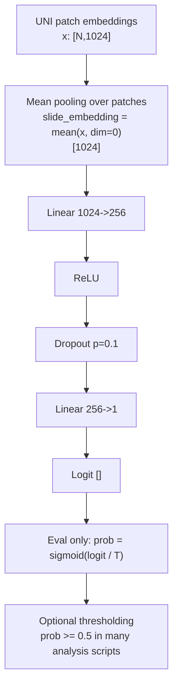
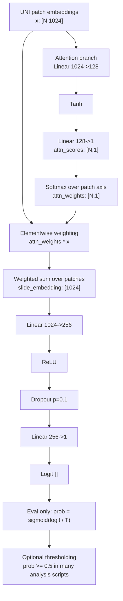
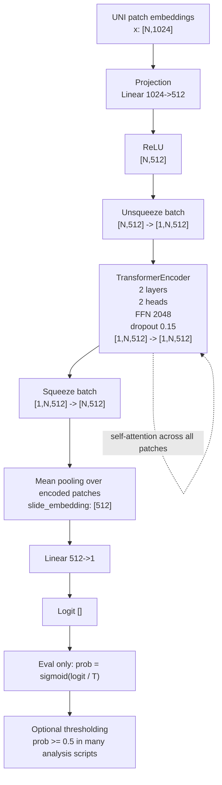

# Architecture And Training Regimes

> **Note on fair-comparison configs**: The configs documented here (`uni_mean.yaml`,
> `uni_attention.yaml`, `paper_reproduction.yaml`) are the original exploratory configs.
> For the main experimental comparison, use the fair-comparison equivalents:
> `configs/uni_mean_fair.yaml`, `configs/uni_attention_fair.yaml`, and
> `configs/paper_reproduction_fair.yaml`. The fair-comparison configs fix `split_seed: 0`
> across all models to ensure identical data splits. **Forward-pass architecture is identical**
> between the original and fair-comparison variants. However, the training regimes differ
> significantly for `paper_reproduction_fair.yaml` vs `paper_reproduction.yaml`: the fair
> version uses 512-patch sampling, AdamW, weighted BCE, early stopping, and EMA — none of
> which are present in the original. The fair-comparison configs should be treated as a
> separate training protocol, not a drop-in replacement.

This document describes the implemented behavior behind:

- `configs/uni_mean.yaml` (see also: `configs/uni_mean_fair.yaml`)
- `configs/uni_attention.yaml` (see also: `configs/uni_attention_fair.yaml`)
- `configs/paper_reproduction.yaml` (see also: `configs/paper_reproduction_fair.yaml`)

The goal here is to document the true code path, not just the config intent.

## Common I/O Conventions

- Input to all three models is a single slide bag of UNI patch embeddings:
  - `x`: `[N, 1024]`
  - `N` = number of patches in the bag
- `coords` are loaded with shape `[N, 2]` but are not used by any of these three models.
- Each model outputs:
  - `logit`: scalar `[]`
  - `slide_embedding`: `[1024]` for `uni_mean` and `uni_attention`
  - `slide_embedding`: `[512]` for `paper_reproduction`
- Training loss is applied on the scalar logit with `BCEWithLogitsLoss` in all three configs.
- Evaluation path in `train.py` is:
  - `prob = sigmoid(logit / T)`
  - `T` is fit post hoc on the validation set by temperature scaling
- Downstream analysis scripts often convert probability to a hard decision with `prob >= 0.5`, although some scripts also sweep or tune thresholds separately.

## Side-By-Side Architecture Figure

```mermaid
flowchart LR
    subgraph M["`uni_mean.yaml`"]
        M0["Input bag
x: [N,1024]
train: N<=512 sampled
eval: full bag"]
        M1["Mean over patches
reduce dim 0
[N,1024] -> [1024]
trainable: none"]
        M2["Classifier
Linear 1024->256
ReLU
Dropout p=0.1
Linear 256->1
trainable: 262,657"]
        M3["Slide logit
[]"]
        M4["Eval only
Temperature scaling
sigmoid(logit / T)
-> prob"]
        M5["Optional hard decision
prob >= threshold
default often 0.5"]
        M0 --> M1 --> M2 --> M3 --> M4 --> M5
    end

    subgraph A["`uni_attention.yaml`"]
        A0["Input bag
x: [N,1024]
train: N<=512 sampled
eval: full bag"]
        A1["Attention scorer
Linear 1024->128
Tanh
Linear 128->1
[N,1024] -> [N,1]
trainable: 131,329"]
        A2["Softmax over patches
[N,1] -> [N,1]
attention weights"]
        A3["Weighted sum interaction
attn_weights * x
sum over N
[N,1] x [N,1024] -> [1024]
trainable: none"]
        A4["Classifier
Linear 1024->256
ReLU
Dropout p=0.1
Linear 256->1
trainable: 262,657"]
        A5["Slide logit
[]"]
        A6["Eval only
Temperature scaling
sigmoid(logit / T)
-> prob"]
        A7["Optional hard decision
prob >= threshold
default often 0.5"]
        A0 --> A1 --> A2
        A0 --> A3
        A2 --> A3 --> A4 --> A5 --> A6 --> A7
    end

    subgraph P["`paper_reproduction.yaml`"]
        P0["Input bag
x: [N,1024]
train: full bag
eval: full bag"]
        P1["Projection
Linear 1024->512
ReLU
[N,1024] -> [N,512]
trainable: 524,800"]
        P2["Transformer encoder x2 layers
self-attention interactions across patches
[1,N,512] -> [1,N,512]
trainable: 6,304,768"]
        P3["Mean over encoded patches
[N,512] -> [512]
trainable: none"]
        P4["Classifier
Linear 512->1
trainable: 513"]
        P5["Slide logit
[]"]
        P6["Eval only
Temperature scaling
sigmoid(logit / T)
-> prob"]
        P7["Optional hard decision
prob >= threshold
default often 0.5"]
        P0 --> P1 --> P2 --> P3 --> P4 --> P5 --> P6 --> P7
        P2 -. patch-to-patch attention .-> P2
    end
```

## Config Comparison

| Config | Implemented model | Training bag size | Eval bag size | Loss weighting | Optimizer | Epochs | Early stopping | EMA on selection metric | Best checkpoint used |
| --- | --- | --- | --- | --- | --- | --- | --- | --- | --- |
| `uni_mean.yaml` | `MeanPoolMIL` | random sample up to 512 patches | full bag | yes (`pos_weight = n_neg / n_pos`) | `AdamW(lr=1e-4, weight_decay=1e-4)` | 30 | yes, patience 10 | yes, `ema_alpha=0.7` default | yes |
| `uni_attention.yaml` | `AttentionMIL` | random sample up to 512 patches | full bag | yes (`pos_weight = n_neg / n_pos`) | `AdamW(lr=1e-4, weight_decay=1e-4)` | 30 | yes, patience 10, min 10 epochs | yes, `ema_alpha=0.7` | yes |
| `paper_reproduction.yaml` | `TransformerMIL` | full bag | full bag | no | `Adam(lr=1e-4)` | 200 | no | no | no, final epoch weights |

## `uni_mean.yaml`

### True forward path

### Trainable parameters

- Mean pooling: `0`
- Classifier `Linear(1024,256)`: `1024*256 + 256 = 262,400`
- Classifier `Linear(256,1)`: `256*1 + 1 = 257`
- Total: `262,657`

### Training regime notes

- Training bags are patch-sampled with `RandomPatchSampler(max_patches=512)`.
- The 512-patch training bag is drawn on fetch, not precomputed once per slide.
- In practice, the sampled subset can change across epochs because sampling happens inside dataset `__getitem__`.
- Validation and test use full bags.
- Selection metric is `val_auprc`, smoothed with EMA before checkpoint selection.
- Although this is called "mean pool", the classifier head is a 2-layer MLP, not a single linear probe.

## `uni_attention.yaml`

### True forward path

### Trainable parameters

- Attention `Linear(1024,128)`: `1024*128 + 128 = 131,200`
- Attention `Linear(128,1)`: `128*1 + 1 = 129`
- Classifier `Linear(1024,256)`: `262,400`
- Classifier `Linear(256,1)`: `257`
- Total: `393,986`

### Training regime notes

- Training bags are patch-sampled with `RandomPatchSampler(max_patches=512)`.
- The 512-patch training bag is drawn on fetch, not fixed for the whole run.
- This means training sees different subsets of the same slide across epochs.
- Validation and test use full bags.
- Selection metric is `val_auprc`, smoothed with EMA using `ema_alpha=0.7`.
- The interaction to pay attention to is:
  - patch embeddings produce attention scores
  - softmax-normalized weights interact multiplicatively with the original embeddings
  - the weighted sum becomes the slide representation

## `paper_reproduction.yaml`

### True forward path

### Trainable parameters

- Projection `Linear(1024,512)`: `1024*512 + 512 = 524,800`
- Transformer encoder layer 1:
  - self-attention qkv in-proj: `786,432 + 1,536 = 787,968`
  - self-attention out-proj: `262,144 + 512 = 262,656`
  - FFN `512->2048`: `1,048,576 + 2,048 = 1,050,624`
  - FFN `2048->512`: `1,048,576 + 512 = 1,049,088`
  - norm1: `512 + 512 = 1,024`
  - norm2: `512 + 512 = 1,024`
  - layer 1 total: `3,152,384`
- Transformer encoder layer 2: `3,152,384`
- Classifier `Linear(512,1)`: `512 + 1 = 513`
- Total: `6,830,081`

### Training regime notes

- Full bags are used in training and evaluation because `max_patches: null`.
- There is no train-time bag resampling in this config because no truncation is applied.
- Optimizer is `Adam`, not `AdamW`.
- Class weighting is disabled.
- AMP is enabled if CUDA is available.
- EMA is disabled.
- Early stopping is disabled.
- Final epoch weights are used even if earlier validation performance was better.
- Despite the config name, the true code path here is:
  - linear projection
  - PyTorch `TransformerEncoder`
  - mean pooling
  - linear classifier

## Important Cross-Cutting Notes

- Thresholding is not part of model forward.
  - The model ends at a scalar logit.
  - Probability conversion and thresholding happen in evaluation or downstream analysis.
- Temperature scaling is always run at the end of training in `train.py`, even for the so-called paper reproduction config.
- For all three configs, the data split is case-grouped and stratified.
- `batch_size=1` means each optimization step processes one slide bag.
- These three models ignore coordinates entirely, even though coordinates are available.

## Source Files

### Original exploratory configs
- [`configs/uni_mean.yaml`](/home/matthew/projects/surgen-mil/configs/uni_mean.yaml)
- [`configs/uni_attention.yaml`](/home/matthew/projects/surgen-mil/configs/uni_attention.yaml)
- [`configs/paper_reproduction.yaml`](/home/matthew/projects/surgen-mil/configs/paper_reproduction.yaml)

### Fair-comparison configs (use these for reproducible experiments)
- [`configs/uni_mean_fair.yaml`](/home/matthew/projects/surgen-mil/configs/uni_mean_fair.yaml)
- [`configs/uni_attention_fair.yaml`](/home/matthew/projects/surgen-mil/configs/uni_attention_fair.yaml)
- [`configs/paper_reproduction_fair.yaml`](/home/matthew/projects/surgen-mil/configs/paper_reproduction_fair.yaml)

### Model implementations
- [`src/models/aggregators/mean_pool.py`](/home/matthew/projects/surgen-mil/src/models/aggregators/mean_pool.py)
- [`src/models/aggregators/attention_mil.py`](/home/matthew/projects/surgen-mil/src/models/aggregators/attention_mil.py)
- [`src/models/aggregators/transformer_mil.py`](/home/matthew/projects/surgen-mil/src/models/aggregators/transformer_mil.py)
- [`src/models/build.py`](/home/matthew/projects/surgen-mil/src/models/build.py)
- [`train.py`](/home/matthew/projects/surgen-mil/train.py)
- [`src/losses.py`](/home/matthew/projects/surgen-mil/src/losses.py)
