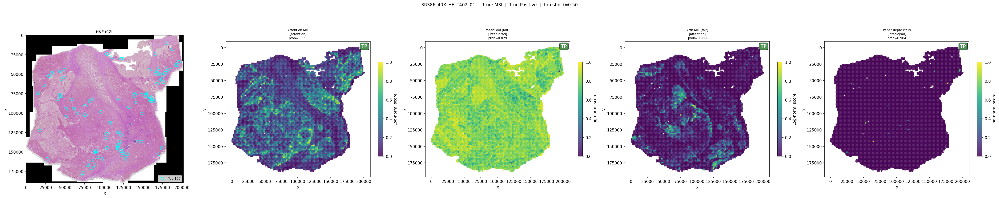

# Attention Visualization

Attention-MIL models produce a per-patch scalar weight for each slide, making it possible to
visualize *which tissue regions the model focuses on* when making a prediction. This document
covers how to generate attention maps, what the outputs look like, and how to interpret them.

---

## What is being visualized

For each slide, the model assigns attention weights across all N patches (one weight per patch).
These weights are:

1. **Softmax-normalized** over the whole bag — they sum to 1.
2. **Visualized spatially** by placing each patch's weight at its tile coordinate (x, y in pixels).

Because the raw weights span a narrow range (many patches get similar small values), the
visualization applies a **log-stretch** before plotting:

```
scores_norm = log_normalise(raw_weights)
           = normalise(log(normalise(raw_weights) + ε))
```

This expands contrast in the low-attention region, making it easier to see spatial structure.
The colormap is `viridis` (perceptually uniform; dark blue = low attention, yellow = high).

For non-attention models (MeanPool, TransformerMIL), the script falls back to
**Integrated Gradients** — the attribution of each patch to the output logit is computed
along the interpolation path from a zero baseline. The L2 norm of the attribution vector
gives a per-patch saliency score, which is visualized the same way.

---

## Generating attention maps

### Auto mode (recommended): TP / FP / FN / TN examples

```bash
python scripts/failures/compare_attention.py \
    --auto --n_examples 3 --topk 100 --out outputs/attention_viz
```

This mode:
1. Loads all `predictions.csv` files from every model×seed in the `MODELS` registry.
2. Counts how consistently each slide is classified as TP/FP/FN/TN across all runs.
3. Selects the `n_examples` most *consistently* classified slides per category.
4. Generates one figure per slide with one panel per model (latest seed only).

Slide selection is cross-model: a TP slide ranked first is a true positive in *every* model
and seed combination, not just the best run.

### Single slide

```bash
python scripts/failures/compare_attention.py \
    --slide_id SR1482_40X_HE_T176_01 --topk 100 --out outputs/attention_viz
```

### Seed grid: rows = models, cols = seeds

```bash
python scripts/failures/compare_attention.py \
    --auto --seed_grid --n_examples 2 --out outputs/attention_viz/seed_grid
```

The seed-grid layout is useful for assessing **within-slide seed variance**: does the model
consistently attend to the same region, or does the attention pattern shift between training seeds?

### Via Makefile

```bash
make attn-auto         # auto TP/FP/FN/TN, n=3 per category
make attn-seed-grid    # seed grid, n=2 per category
make attn-slide SLIDE=SR1482_40X_HE_T176_01
```

---

## Figure layout

**Default mode** (`--auto` without `--seed_grid`):

```
| [H&E thumbnail (if CZI available)] | Model 1 | Model 2 | Model 3 | ... |
```

Each model panel shows:
- Scatter plot of patch coordinates, colored by log-normalised attention score
- Colorbar on the right (0 = dark blue, 1 = yellow)
- Title: model name, prediction probability
- Outcome badge (TP/FP/FN/TN) in the top-right corner, color-coded:
  - TP: dark green (`#2e7d32`)
  - TN: dark blue (`#1565c0`)
  - FP: dark red (`#c62828`)
  - FN: purple (`#6a1b9a`)

**Seed grid mode** (`--seed_grid`):

```
            | seed 001 | seed 002 | seed 003 |
| Model A   |  panel   |  panel   |  panel   |
| Model B   |  panel   |  panel   |  panel   |
```

Scores are normalised **per cell**, so the spatial distribution is comparable across seeds even
if absolute attention magnitudes differ.

---

## Output files

All figures are written to `--out` (default `outputs/attention_viz/`):

| Pattern | Description |
|---------|-------------|
| `{category}_{slide_id}_compare_attention.png` | Default mode (one row, models as columns) |
| `{category}_{slide_id}_seed_grid.png` | Seed-grid mode |
| `{slide_id}_attention.png` | Legacy single-model format (older runs) |

where `category` is `tp`, `fp`, `fn`, or `tn`.

---

## Configuring which models are shown

The `MODELS` dict at the top of `scripts/failures/compare_attention.py` controls which model
output directories are loaded:

```python
MODELS: dict[str, str] = {
    "Attention MIL":        "outputs/uni_attention",
    "Gated Attention":      "outputs/uni_gated_attention",
    "Top-k (k=4)":          "outputs/uni_topk_attention_k4",
    "Attn MIL (fair)":      "outputs/uni_attention_fair",
    "Paper Repro (fair)":   "outputs/paper_reproduction_fair",
}
```

Models whose output directory does not exist are silently skipped. To restrict to only the
fair-comparison models, comment out or remove the exploratory entries.

---

## Example outputs

All examples are selected by the cross-model consistency method in `select_slides()`: slides are
ranked by how consistently every model×seed combination agrees on the outcome, so the examples
shown are the most robustly classified slides in the test set — not cherry-picked individual runs.

Left to right in each figure: H&E thumbnail (where CZI is available), Attention MIL
(experimental), MeanPool (fair) [integ-grad], Attn MIL (fair), Paper Repro (fair) [integ-grad].

A note on MeanPool IG: even though the forward pass averages all patches equally, integrated
gradients reveal which patches most strongly move the output when interpolated from zero. Where
the MeanPool IG map broadly agrees with the attention maps, it is a good sign that the spatial
signal is real rather than an artefact of the attention mechanism.

---

### True Positive — all models confidently correct

Slide `SR386_40X_HE_T402_01` (true MSI, all models predict MSI; prob ≥ 0.83).



Attention is broadly distributed across the tissue in all models. MeanPool IG closely tracks
the attention pattern of the learned models, reinforcing that the discriminative signal is
spatially distributed rather than localised. Paper Repro IG is flatter but still directionally
consistent.

---

### False Positive — all models confidently wrong

Slide `SR1482_40X_HE_T061_02` (true MSS, all models predict MSI; prob ≥ 0.90).


All four models are confidently wrong and their attention maps are broadly similar — suggesting
the tissue contains morphological features that systematically resemble MSI slides. This is a
harder failure mode than seed noise: no model in the ensemble escapes it. The H&E thumbnail
shows the tissue context; note the spatial correspondence between the attention-highlighted
regions and the tissue boundary.

---

### False Negative — experimental ceiling shows signal is present

Slide `SR386_40X_HE_T436_01` (true MSI; fair models near threshold, Paper Repro abstains).


Left to right: H&E thumbnail, Attention MIL (experimental, prob=0.75), MeanPool (fair)
[integ-grad, prob=0.07], Attn MIL (fair, prob=0.76), Paper Repro (fair) [integ-grad, prob=0.06].

The experimental Attention MIL and Attn MIL (fair) are both near the decision boundary, while
MeanPool and Paper Repro are confidently wrong. The experimental model serves as a useful ceiling:
the discriminative signal is present and partially recoverable, but not captured reliably under
the controlled training regime. Paper Repro IG is nearly flat — the transformer is effectively
abstaining on this slide.

---

### True Negative — all models correctly suppress

Slide `SR386_40X_HE_T129_01` (true MSS, all models predict MSS; prob ≤ 0.09).


All attention maps are dark and low-entropy — the models agree there is little evidence of MSI
morphology anywhere in the tissue. MeanPool IG is nearly flat, consistent with a slide where no
patch drives a strong positive signal. This is what "correct suppression" looks like: the spatial
signal is absent, not just averaged out.

---

## Quantitative attention diagnostics

For per-slide attention statistics (entropy, effective support, top-k mass), use:

```bash
python scripts/inspect_attention.py \
    --config configs/uni_attention_fair.yaml \
    --checkpoint outputs/uni_attention_fair/runs/001/model.pt \
    --out outputs/attention_stats.csv
```

Or via Makefile:

```bash
make attn-stats
```

Output columns: `slide_id`, `n_patches`, `attn_entropy`, `effective_support`, `top10_mass`,
`top50_mass`, `prob`, `label`, `split`.

---

## Limitations

- **No patch-level ground truth**: attention maps show where the model looks, not where MSI
  morphology actually is. There is no way to validate spatial correctness from slide-level labels alone.
- **Scale sensitivity**: log-normalisation is per-slide; absolute attention values are not comparable
  across slides or models.
- **TransformerMIL uses gradients, not attention**: the `paper_reproduction_fair` model does not
  have attention weights; saliency is computed via integrated gradients, which is slower and
  may not reflect the same spatial inductive bias as softmax attention.
- **CZI thumbnails are optional**: raw CZI files are not distributed with the dataset; the H&E
  column appears only if `aicspylibczi` is installed and the CZI file exists at `data.root`.
