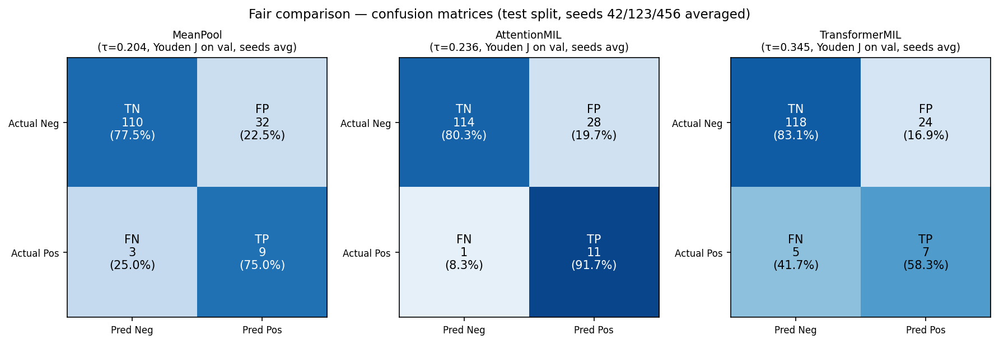

# Results Summary

## Primary Comparison

All models trained with seeds {42, 123, 456}, fixed split (`split_seed=0`), temperature scaling.
Confusion matrices use seed-averaged predictions with Youden J threshold fit on the validation set.

| Model | AUROC (mean ± std) | AUPRC (mean ± std) |
|-------|--------------------|--------------------|
| MeanPool (weighted BCE) | 0.860 ± 0.005 | 0.447 ± 0.019 |
| AttentionMIL (weighted BCE) | 0.869 ± 0.020 | 0.381 ± 0.052 |
| TransformerMIL (unweighted BCE, Adam) | 0.806 ± 0.057 | 0.391 ± 0.116 |
| *Paper baseline (Myles et al.)* | *0.827* | *—* |

## Qualitative Interpretation

- **MeanPool is the strongest stable baseline.** Simple averaging of frozen UNI features is competitive
  with more complex architectures. The UNI backbone already encodes the relevant morphological signal.

- **AttentionMIL is promising but seed-dependent.** When it works, it matches or exceeds MeanPool.
  Variance across seeds is higher, suggesting the attention mechanism is hard to train stably at this
  sample size.

- **TransformerMIL is not justified in this data regime.** With 6.8M parameters and no patch-level
  labels, the Transformer overfits. It is included for comparison with prior work, not as a recommended
  approach.

## Stable Conclusions

1. Frozen UNI embeddings contain strong discriminative signal for MSI/MMR status.
2. Simple pooling is a hard-to-beat baseline at this data scale.
3. The main limitation is training instability under weak supervision — not absence of signal.
4. Sparse evidence selection (top-k attention) shows conditional benefit but is not robustly superior.

## Appendix Results

### Appendix A — Aggregator and loss ablations

Comparison against the MeanPool weighted-BCE baseline (`uni_mean_fair`).

| Model | AUROC | AUPRC | Note |
|-------|-------|-------|------|
| MeanPool (weighted BCE) | 0.860 ± 0.005 | 0.447 ± 0.019 | baseline |
| InstanceMean (weighted BCE) | 0.859 ± 0.008 | 0.443 ± 0.027 | classify-then-pool |
| MeanPool (unweighted BCE) | 0.862 ± 0.003 | 0.465 ± 0.004 | no class reweighting |

### Appendix B — Loss function ablation (AttentionMIL)

| Model | AUROC | AUPRC | Note |
|-------|-------|-------|------|
| AttentionMIL (weighted BCE) | 0.869 ± 0.020 | 0.381 ± 0.052 | baseline |
| AttentionMIL (focal, α=0.5, γ=2) | 0.863 ± 0.014 | 0.420 ± 0.066 | focal loss |

### Appendix C — Sparse evidence selection

| Model | AUROC | AUPRC | Note |
|-------|-------|-------|------|
| AttentionMIL (weighted BCE) | 0.869 ± 0.020 | 0.381 ± 0.052 | full bag |
| TopK-16 AttentionMIL (weighted BCE) | 0.853 ± 0.032 | 0.455 ± 0.139 | k=16 (≈3% of 512-patch training bag) |

### Appendix D — Train-time sampler ablation

This section is reserved for the Phase 1 bag-sampler comparison. The intended protocol is:

- same split (`split_seed=0`)
- same training seeds `{42, 123, 456}`
- same `max_patches=512`
- same full-bag evaluation
- same optimizer / LR / early stopping within each model family
- different **re-sampled** train-time bag construction rules only

The train-time sampler is applied on fetch, so sampled bags can differ across epochs. Results here
should therefore be interpreted as differences in training-time evidence exposure, not differences
in evaluation-time evidence usage.

#### MeanPoolMIL

| Model | AUROC | AUPRC | Note |
|-------|-------|-------|------|
| MeanPool + random | TBD | TBD | baseline train-time sampler |
| MeanPool + spatial balanced | TBD | TBD | grid-based coverage sampler |
| MeanPool + feature diverse | TBD | TBD | feature-space coverage sampler |

#### AttentionMIL

| Model | AUROC | AUPRC | Note |
|-------|-------|-------|------|
| AttentionMIL + random | TBD | TBD | baseline train-time sampler |
| AttentionMIL + spatial balanced | TBD | TBD | grid-based coverage sampler |
| AttentionMIL + feature diverse | TBD | TBD | feature-space coverage sampler |

#### Planned interpretation prompts

- Does enforcing spatial coverage improve generalisation or only reduce variance?
- Does feature-space diversity help more for MeanPool or for AttentionMIL?
- Do gains, if any, persist under full-bag evaluation?
- Is the main effect performance lift, seed-stability improvement, or both?

*All appendix metrics: mean ± std across seeds {42, 123, 456}, same split as main comparison.
Regenerate with `python scripts/appendix_tables.py --out outputs/appendix_tables.csv`.*

## Limitations

- Sample size: both cohorts are small relative to the parameter counts of more expressive models.
- Label quality: MSI/MMR labels are assigned at the patient level; slide-level ground truth is not
  available.
- Single site: results may not generalise to slides from different scanners or staining protocols.
- No external validation: all evaluation is on held-out cases from the same cohort distribution.
