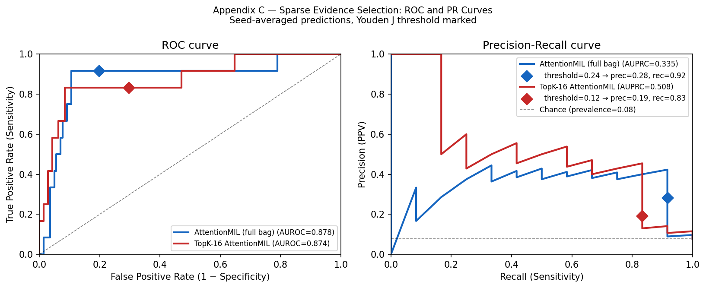
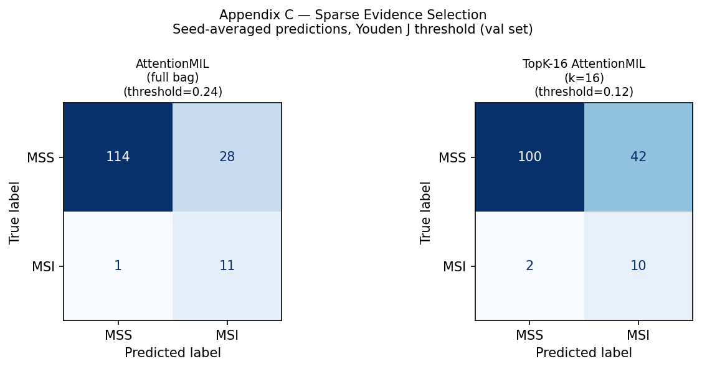
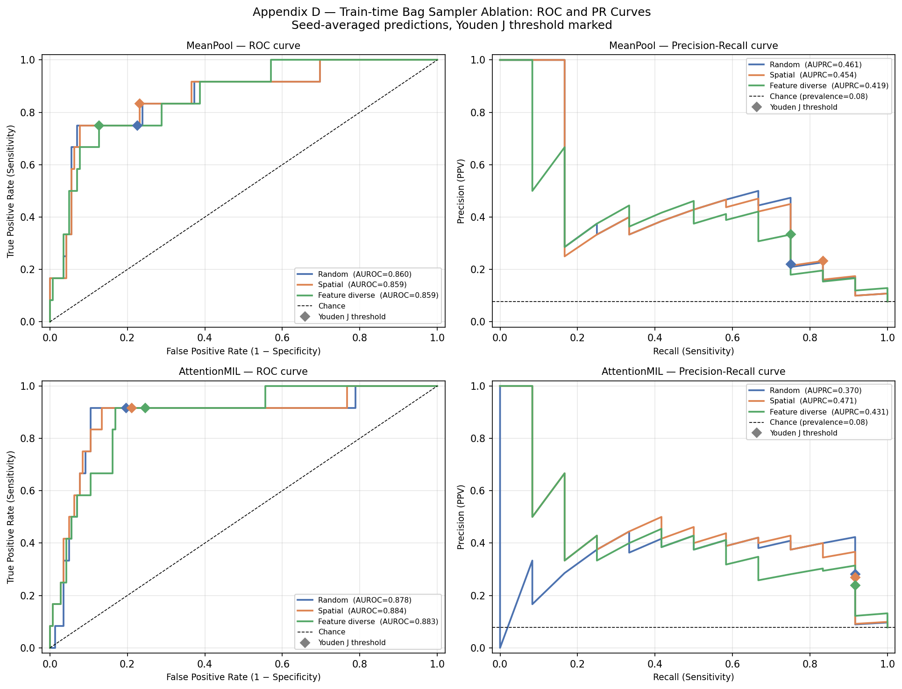
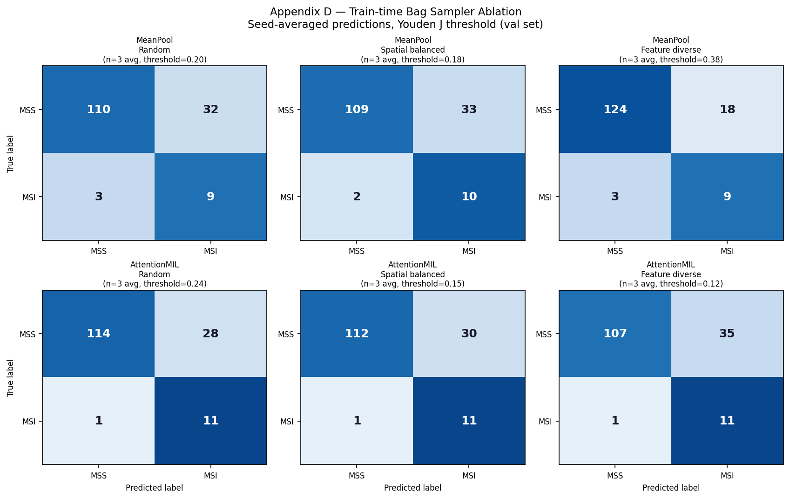

# Results Summary

## Primary Comparison

All models trained with seeds {42, 123, 456}, fixed split (`split_seed=0`), temperature scaling.
Confusion matrices use seed-averaged predictions with Youden J threshold fit on the validation set.

| Model | AUROC (mean ± std) | AUPRC (mean ± std) |
|-------|--------------------|--------------------|
| MeanPool (weighted BCE) | 0.860 ± 0.005 | 0.447 ± 0.019 |
| AttentionMIL (weighted BCE) | 0.869 ± 0.020 | 0.381 ± 0.052 |
| TransformerMIL (unweighted BCE, Adam) | 0.806 ± 0.057 | 0.391 ± 0.116 |
| *Paper baseline (Myles et al.)* | *0.827* | *—* |

> REVIEW: The TransformerMIL label conflicts with the current fair config, which uses weighted BCE and AdamW. Confirm whether these metrics come from an older run setup. Also add a direct citation or explanatory note for the paper baseline value.

## Qualitative Interpretation

- **MeanPool is the strongest stable baseline.** Simple averaging of frozen UNI features is competitive
  with more complex architectures. The UNI backbone already encodes the relevant morphological signal.

- **AttentionMIL is promising but seed-dependent.** When it works, it matches or exceeds MeanPool.
  Variance across seeds is higher, suggesting the attention mechanism is hard to train stably at this
  sample size.

- **TransformerMIL is not justified in this data regime.** With 6.8M parameters and no patch-level
  labels, the Transformer overfits. It is included for comparison with prior work, not as a recommended
  approach.

> REVIEW: This section repeatedly shifts from observation to causal explanation. "relevant morphological signal," "hard to train stably," and "overfits" are not directly established by the summary table alone. "not justified" and "recommended" are decision language that should either reference explicit criteria or be softened.

## Stable Conclusions

1. Frozen UNI embeddings contain strong discriminative signal for MSI/MMR status.
2. Simple pooling is a hard-to-beat baseline at this data scale.
3. The main limitation is training instability under weak supervision — not absence of signal.
4. Sparse evidence selection (top-k attention) shows conditional benefit but is not robustly superior.

> REVIEW: These are framed as "Stable Conclusions" but several are still interpretive. #3 is especially strong because it rules out another explanation ("not absence of signal") that the present experiment does not conclusively eliminate.

## Appendix Results

### Appendix A — Aggregator and loss ablations

Comparison against the MeanPool weighted-BCE baseline (`uni_mean_fair`).

| Model | AUROC | AUPRC | Note |
|-------|-------|-------|------|
| MeanPool (weighted BCE) | 0.860 ± 0.005 | 0.447 ± 0.019 | baseline |
| InstanceMean (weighted BCE) | 0.859 ± 0.008 | 0.443 ± 0.027 | classify-then-pool |
| MeanPool (unweighted BCE) | 0.862 ± 0.003 | 0.465 ± 0.004 | no class reweighting |

### Appendix B — Loss function ablation (AttentionMIL)

| Model | AUROC | AUPRC | Note |
|-------|-------|-------|------|
| AttentionMIL (weighted BCE) | 0.869 ± 0.020 | 0.381 ± 0.052 | baseline |
| AttentionMIL (focal, α=0.5, γ=2) | 0.863 ± 0.014 | 0.420 ± 0.066 | focal loss |

### Appendix C — Sparse evidence selection

| Model | AUROC | AUPRC | Note |
|-------|-------|-------|------|
| AttentionMIL (weighted BCE) | 0.869 ± 0.020 | 0.381 ± 0.052 | full bag |
| TopK-16 AttentionMIL (weighted BCE) | 0.853 ± 0.032 | 0.455 ± 0.139 | k=16 (≈3% of 512-patch training bag) |

**Reading the PR curve**: AUPRC is the area under the precision-recall curve — it measures how
well the model ranks true positives above true negatives across *all* possible thresholds.
TopK-16 (red) sits above AttentionMIL (blue) across most of the PR curve, meaning at
intermediate recall levels it maintains higher precision for the same sensitivity. However, the
Youden J threshold (diamond markers) selects the operating point that maximises
sensitivity + specificity − 1 — which for AttentionMIL lands at high recall (0.92) with moderate
precision (0.28), while TopK-16's Youden point is worse on both dimensions (rec=0.83, prec=0.19).

A model can have higher AUPRC and a worse Youden operating point simultaneously: AUPRC rewards
good ranking across the full curve, while Youden selects the single best threshold under that
metric. The two are complementary, not redundant.

The confusion matrices make the operating-point shift concrete: TopK-16's threshold drops from
0.24 to 0.12, FPs increase from 28 to 42, and sensitivity drops from 11/12 to 10/12. Whether
the AUPRC improvement is worth the worse Youden operating point depends on the clinical cost of
false positives versus false negatives.

### Appendix D — Train-time sampler ablation

This section is reserved for the Phase 1 bag-sampler comparison. The intended protocol is:

- same split (`split_seed=0`)
- same training seeds `{42, 123, 456}`
- same `max_patches=512`
- same full-bag evaluation
- same optimizer / LR / early stopping within each model family
- different **re-sampled** train-time bag construction rules only

The train-time sampler is applied on fetch, so sampled bags can differ across epochs. Results here
should therefore be interpreted as differences in training-time evidence exposure, not differences
in evaluation-time evidence usage.

#### MeanPoolMIL

| Model | AUROC | AUPRC | Note |
|-------|-------|-------|------|
| MeanPool + random | 0.860 ± 0.005 | 0.447 ± 0.019 | baseline train-time sampler |
| MeanPool + spatial balanced | 0.859 ± 0.007 | 0.447 ± 0.014 | grid-based coverage sampler |
| MeanPool + feature diverse | 0.852 ± 0.005 | 0.358 ± 0.035 | feature-space coverage sampler |

#### AttentionMIL

| Model | AUROC | AUPRC | Note |
|-------|-------|-------|------|
| AttentionMIL + random | 0.869 ± 0.020 | 0.381 ± 0.052 | baseline train-time sampler |
| AttentionMIL + spatial balanced | 0.861 ± 0.031 | 0.404 ± 0.058 | grid-based coverage sampler |
| AttentionMIL + feature diverse | 0.879 ± 0.006 | 0.407 ± 0.058 | feature-space coverage sampler |

#### Figures

#### Interpretation

**Sampler choice has minimal effect on MeanPool.** Random and spatial samplers match closely
(AUROC 0.860/0.859, AUPRC 0.447/0.447). Feature-diverse sampling hurts AUPRC notably
(0.358 ± 0.035), possibly because forcing representational spread selects atypical patches that
are less discriminative for the weighted mean.

**AttentionMIL shows high seed variance that obscures sampler signal.** AUPRC std is 0.052–0.058
across seeds for all three samplers, making mean differences (0.381 vs 0.404 vs 0.407)
unreliable. Feature-diverse sampling achieves the lowest AUROC variance (± 0.006), suggesting
more stable training dynamics when patch selection is deterministic in feature space.

**Confusion matrices reveal stable operating points for MeanPool, variable for AttentionMIL.**
MeanPool thresholds (0.20–0.38) and TP/FP counts are consistent across samplers. AttentionMIL
spatial sampling has a noticeably lower threshold (0.15) with more FPs, while random and
feature-diverse are closer to the full-bag baseline (threshold ≈ 0.24).

**Summary:** Sampler choice does not meaningfully improve over random for either model family at
this scale. The main finding is negative: richer sampling strategies do not compensate for the
inherent instability of attention-based MIL under small training sets.

*All appendix metrics: mean ± std across seeds {42, 123, 456}, same split as main comparison.
Regenerate with `python scripts/appendix_tables.py --out outputs/appendix_tables.csv`.*

## Limitations

- Sample size: both cohorts are small relative to the parameter counts of more expressive models.
- Label quality: MSI/MMR labels are assigned at the patient level; slide-level ground truth is not
  available.
- Single site: results may not generalise to slides from different scanners or staining protocols.
- No external validation: all evaluation is on held-out cases from the same cohort distribution.
